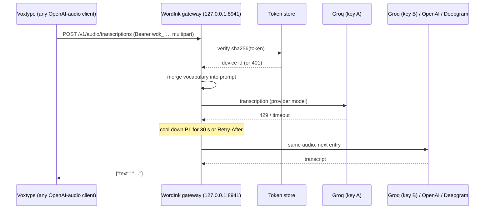

# WordInk Desktop Gateway - Plan

## Goal Capsule

- **Objective:** Desktop dictation apps people already use (Voxtype on Linux first, TypeWhisper on macOS and Windows next) get reliable transcription through WordInk. If one provider is down or rate-limited, dictation keeps working. Provider keys live in one place, and each device gets its own revocable access.
- **Means:** An OpenAI-compatible transcription endpoint on `@wordink/server`, with provider fallback, per-device tokens and server-side vocabulary hints, run as a local user service (KTD1–KTD9).
- **Product authority:** Luke (duketopceo). This plan owns the gateway and the Voxtype integration. A TypeWhisper plugin, LLM cleanup and usage logging are not active scope.
- **Authority order:** Product Contract, then Key Technical Decisions, then unit Approach text.
- **Stop conditions:**
  - Stop if Voxtype can't be pointed at the gateway with only an endpoint and key change.
  - Stop if gateway changes would alter the browser relay routes' behavior (R11).
  - Stop before any action that sends a provider key off this machine.
- **Execution profile:** Standard. U1 and U3 can run in parallel, then U2, then U4, then U5, U6 and U7.
- **Finish and ship:** One PR stacked on #26 (branch `feat/p2-gateway`). U7 switches the owner's own Voxtype to the gateway, so it is reversible and its rollback is documented.
- **Open blockers:** None. Only Groq keys exist in omaseal (`groq/default`, `Groq-Hermes-API`), so the live fallback check uses two Groq keys. OpenAI and Deepgram entries are exercised with mocks until the owner adds keys.
- **Product Contract preservation:** changed R5 (fall-through now lists 5xx and provider 401/403, matching AE1) and R13 (remote and Cloudflare deployment deferred; review found no consistent token or rate-limit path there). Outstanding Questions resolved in KTD3, KTD4, KTD5 and KTD9.

## Product Contract

### Summary

WordInk Phase 2 reaches the desktop by integrating, not by shipping its own app. `@wordink/server` gains a standard `POST /v1/audio/transcriptions` endpoint. Any app that speaks the OpenAI audio API can point at it, Voxtype's remote mode included. The gateway routes each request to Groq, falling back to OpenAI or Deepgram, and authenticates devices with WordInk tokens instead of provider keys.

### Problem Frame

Desktop dictation apps each hold a provider key and talk to one provider directly. When that provider rate-limits or goes down, dictation stops until someone edits the app's config. Every device carries a long-lived provider key, and the custom vocabulary is maintained separately in each app. Today Voxtype holds a long hand-maintained `initial_prompt`. TypeWhisper (macOS, Windows, iOS) and Voxtype (Linux) already solve the desktop UX well. What they lack is a resilient, key-safe backend, and that is what WordInk's relay already almost is.

### Key Decisions

- Phase 2 integrates with existing desktop apps instead of building a standalone WordInk Desktop. (session-settled: user-directed — chosen over a standalone Linux app and over skipping desktop: TypeWhisper and Voxtype already cover desktop UX; WordInk's gap is the backend, not another app.)
- v1 scope is provider fallback, per-device tokens and server-side vocabulary. LLM cleanup and usage logging are deferred. (session-settled: user-approved, proposed by the assistant after the user deferred the choice ("you pick"), from the shown options: fallback, keys in one place, LLM cleanup/vocabulary, usage + cost log.)
- The integration surface is the OpenAI audio transcription API shape, because Voxtype's remote mode, and most dictation apps with a "custom endpoint" setting, already speak it.

### Actors

- A1. **Desktop dictation app:** Voxtype, TypeWhisper, or any OpenAI-audio-API client sending recorded audio.
- A2. **Owner/operator:** runs the gateway (locally or remotely), holds the provider keys, and issues and revokes device tokens.
- A3. **Web SDK app:** the existing Phase 1 browser clients, which keep working unchanged.

### Requirements

**Compatible endpoint**
- R1. `POST /v1/audio/transcriptions` accepts the OpenAI multipart shape: `file`, `model`, optional `prompt`, `language`, `response_format` (`json` default, `text`, `verbose_json`), and `temperature`. It returns the matching response shape.
- R2. Voxtype in remote mode works by changing only `remote_endpoint` and the API key. No other Voxtype change is needed.
- R3. The `model` a client sends is accepted whatever it names. The gateway maps it to each provider's own model, so apps configured for Groq or OpenAI model names keep working.

**Provider fallback**
- R4. The operator configures an ordered provider list (default Groq, then OpenAI, then Deepgram), using whichever providers have keys.
- R5. A request falls through to the next provider entry when the current one is rate-limited (429), returns a 5xx, times out, is unreachable, or rejects the operator's key (401/403). A bad-audio or invalid-request error (400, 413, 415) does not fall through.
- R6. A provider that just failed is skipped for a short cooldown, so a single outage doesn't add latency to every request.
- R7. The response tells the client nothing about which provider served it beyond the transcript, and failures stay in the OpenAI error shape.

**Keys and device access**
- R8. Provider keys exist only on the gateway. Devices authenticate with WordInk device tokens sent as `Authorization: Bearer`.
- R9. The operator can create, list and revoke device tokens with a CLI. A revoked token is refused on its next request.
- R10. Tokens are stored hashed. The full token is shown only once, at creation.
- R11. The existing browser relay routes and their cookie-based `authorize` behavior are unchanged.

**Vocabulary**
- R12. The operator sets a gateway-wide vocabulary list, which is merged into each provider's prompt or keyterm field alongside any `prompt` the client sends.

**Running it**
- R13. The gateway runs as a local user service on Linux (systemd user unit), with provider keys read from omaseal or the environment. Remote deployment, including Cloudflare, is deferred.
- R14. Using the gateway adds under 100 ms of median latency on top of a direct provider call, when running locally.

### Key Flows

- F1. **Switch Voxtype to the gateway.** **Trigger:** the operator runs the gateway service and creates a device token. They set Voxtype's `remote_endpoint` to the gateway and its key to the token, then dictate as usual. **Covers R1, R2, R8, R9, R13.**
- F2. **Provider outage.** **Trigger:** Groq returns 429 or times out. The gateway retries on OpenAI, Voxtype receives the transcript as normal, and Groq is skipped until its cooldown ends. **Covers R4, R5, R6, R7.**
- F3. **Lost laptop.** **Trigger:** the operator revokes that device's token. The next request from it is refused, and other devices are unaffected. **Covers R9, R10.**

### Acceptance Examples

- AE1. With Voxtype pointed at a local gateway and Groq's key deliberately invalid, dictation still produces text, served by OpenAI. **Covers R2, R5.**
- AE2. A request with a revoked or unknown token gets 401 in the OpenAI error shape, and no provider is called. **Covers R8, R9.**
- AE3. A client that sends `model: "whisper-1"` gets a transcript from Groq's Whisper model. **Covers R3.**
- AE4. A word in the gateway vocabulary, such as "Omarchy", is spelled correctly even when the client sends no prompt. **Covers R12.**

### Success Criteria

- The user's own Voxtype runs through the gateway day to day, with the provider key removed from Voxtype's configuration.
- A simulated Groq outage doesn't interrupt dictation.

### Scope Boundaries

**Deferred for later**
- Remote or Cloudflare deployment of the gateway. It needs a strongly consistent token store (Durable Object, since KV revocation is eventually consistent) and a shared rate limiter.
- TypeWhisper plugin (its plugin SDK and HTTP API), after checking whether TypeWhisper's OpenAI provider accepts a custom base URL, which would make the endpoint alone enough.
- Server-side LLM cleanup of transcripts.
- Usage and cost logging per device and provider.
- Local or offline transcription inside the gateway, such as a native engine host.

**Outside this product's identity**
- A WordInk-branded desktop app with its own hotkeys, text injection or tray.

<!-- ce-section: work-relationships -->
### How This Work Fits Together

1. **Phase 1, Core + Web SDK** (PRs #16–#26) built `@wordink/server`, its fail-closed relay, and its provider protocols. This plan extends that server.
2. **This plan (the gateway)** adds the desktop-facing endpoint, fallback and device tokens.
3. **Next (tentative):** the TypeWhisper plugin, then LLM cleanup and usage logging. All of these build on the gateway's request path.

### Dependencies / Assumptions

- Voxtype's remote mode posts to `{remote_endpoint}/v1/audio/transcriptions` with `Authorization: Bearer <key>` and sends `initial_prompt` as `prompt`. **Verified 2026-10-05** by capturing a real `voxtype transcribe` request (Voxtype 1.0.1, `ureq/2.12.1`): multipart fields `file` (`audio.wav`), `model`, `language`, `prompt`, `response_format=json`; no `Origin` header; the response read is `{"text": ...}`.
- Groq, OpenAI and Deepgram batch transcription APIs remain available. Deepgram's prerecorded endpoint takes raw audio, not multipart, so the gateway must translate.

### Outstanding Questions

None remain. The former planning questions are resolved in KTD3 (token store), KTD4 (model mapping) and KTD5 (cooldown and timeouts).

### Sources / Research

- Voxtype 1.0.1 CLI: `--remote-endpoint`, `--remote-model`, `--remote-api-key` / `VOXTYPE_WHISPER_API_KEY`. The user's config uses `remote_endpoint = "https://api.groq.com/openai"` with `initial_prompt` vocabulary.
- TypeWhisper (GPLv3; macOS, Windows, iOS): cloud providers include Groq, OpenAI and Deepgram; it has an HTTP API and a plugin SDK. https://github.com/TypeWhisper
- Comparison and the decision rationale: `ROADMAP.md` ("Phase 2 decision").

## Planning Contract

### Key Technical Decisions

- KTD1. **One server, one new route.** `createRelay` gains an optional `gateway` config. When it is set, `POST {basePath}/v1/audio/transcriptions` is served, and when it is absent the route 404s as today. The relay's existing routes, fail-closed `authorize` and origin check are untouched (R11). The gateway route authenticates with device tokens instead of `authorize`, because desktop clients send no cookies and no Origin. Governs R1, R8, R11.
- KTD2. **Provider entries are (provider, key) pairs in an ordered list.** For example `[{provider:"groq", keyEnv:"GROQ_API_KEY"}, {provider:"groq", keyEnv:"GROQ_API_KEY_2"}, {provider:"openai", keyEnv:"OPENAI_API_KEY"}]`. Fallback can then cross keys of the same provider (separate rate limits) as well as providers. The config names environment variables only. The service wrapper (KTD8) fills them from omaseal (`groq/default`, `Groq-Hermes-API`, …), so key material is never written to config files. Governs R4, R8.
- KTD3. **Token store is an interface. v1 ships the file backend.** The `TokenStore` interface, token generation and hashing live in shared code (`gateway/tokens.ts`). The Node-only `FileTokenStore` (`gateway/file-tokens.ts`) uses a JSON file at `$XDG_STATE_HOME/wordink/gateway-tokens.json` (mode 0600), re-read when its mtime changes so a CLI revoke takes effect on the next request. It is imported only by `node.ts` and the bin, so the Workers bundle never sees `node:fs`. A remote backend is deferred. Tokens are `wdk_` plus 32 random bytes (base64url), stored as SHA-256 hex with an id, label, creation time and revocation time. Lookup by hash uses a constant-time compare. Governs R9, R10.
- KTD4. **Model mapping is per provider entry.** Each entry carries the model it calls: Groq `whisper-large-v3-turbo`, OpenAI `gpt-4o-transcribe`, Deepgram `nova-3`. The client's `model` is accepted and ignored for routing (R3). An OpenAI `verbose_json` request uses `whisper-1`, since `gpt-4o-transcribe` supports only `json` and `text`.
- KTD5. **Fallback policy.** These fall through to the next entry:
  - 429
  - 5xx
  - a timeout (per-attempt `upstreamTimeoutMs`, default 15 s)
  - a network error
  - a provider 401 or 403, which is an operator key problem, not a client one

  An overall deadline (`gateway.deadlineMs`, default 30 s) bounds the whole chain, so a hung provider can't stack attempt timeouts past a client's own timeout.

  A 400, 413 or 415 does not fall through; it is returned in the OpenAI error shape. A failed entry is cooled down for 30 s, or for `Retry-After` when present (capped at 300 s). Cooled-down entries are skipped, and if every entry is cooling down the one whose cooldown ends first is tried. Governs R5, R6, R7.
- KTD9. **Separate limits and input hygiene.**
  - The gateway route gets its own limiter instance (`gateway.rateLimit`: default 60 requests a minute per token, no daily cap). It never shares state with the browser relay's limiter.
  - Limiter 429s use the OpenAI error shape with `Retry-After`.
  - Client `language` must match `^[A-Za-z]{2,3}(-[A-Za-z0-9]{2,8})*$` or is dropped. Every provider query is built with `URLSearchParams`. No other client field reaches a provider request.
  - The gateway route skips the browser Origin check, because desktop clients send no Origin. Bearer device-token auth replaces it. The browser routes keep their Origin check and fail-closed `authorize` unchanged (R11).
  - When the gateway is configured without an `authorize` hook, the setup log says the browser routes are disabled, rather than reporting a misconfiguration.
- KTD6. **Vocabulary merge.** The operator vocabulary (`gateway.vocabulary: string[]`) is appended to the client `prompt` for Whisper-style providers, de-duplicated and capped at 800 characters with operator terms first. For Deepgram it becomes up to 50 `keyterm` query parameters. Governs R12.
- KTD7. **Request handling.** Buffer the body with the existing `readCapped`, at `gateway.maxBodyBytes` (default 25 MB, Groq's limit). Then parse it with `new Response(bytes, {headers: {"content-type": original}}).formData()`, because the original request stream is already consumed. Re-encode a fresh `FormData` per attempt so a retry never reuses a consumed stream. Send Deepgram the raw `file` bytes with the file's content type. Responses:
  - `json` gives `{"text"}`
  - `text` gives plain text
  - `verbose_json` is normalized for every provider to the OpenAI fields the gateway can fill (`text`, `language`, `duration`, and `segments` when the provider supplies them). Provider-specific fields are dropped (R7).
- KTD8. **Runtime packaging.** `@wordink/server` ships a `wordink-gateway` bin with three commands:
  - `serve`: Node adapter, default `127.0.0.1:8941`, config from `$XDG_CONFIG_HOME/wordink/gateway.json`
  - `tokens create <label> | list | revoke <id>`
  - `check`: a config and key resolution dry run

  A systemd user unit plus a wrapper resolve omaseal keys into the service environment (the same pattern as `~/bin/voxtype-daemon`), so keys never touch disk. Governs R13.

### High-Level Technical Design



### Output Structure

```
packages/server/src/gateway/{index.ts,providers.ts,router.ts,tokens.ts,file-tokens.ts,vocabulary.ts,multipart.ts}
packages/server/src/bin/wordink-gateway.ts
packages/server/test/gateway/*.test.ts
examples/gateway-systemd/{wordink-gateway.service,wordink-gateway-run,gateway.example.json,README.md}
apps/docs/pages/desktop.md  (+ apps/docs/desktop.html stub, nav entry)
```

### Risks & Dependencies

| Risk | Mitigation |
|---|---|
| OpenAI and Deepgram keys are absent, so only Groq is exercised live | Mocked contract tests per provider. The live check falls over between two Groq keys. OpenAI and Deepgram live checks stay as residuals until keys exist |
| Deepgram prerecorded quirks (raw body, keyterm limits) | Contract tests built from Deepgram's documented request and response shapes. Verify live once a key exists |
| A provider chain stacks attempt timeouts past the client's own timeout | Overall `deadlineMs` (30 s, KTD5). U7 checks Voxtype behaves when the gateway answers 504 |
| Long recordings (Voxtype has no 60 s cap) exceed provider limits | 25 MB gateway cap, returning 413 in the OpenAI shape. Documented |
| A device token leaks | Hashed at rest, revocable in one command (takes effect on the next request), per-token rate limit on a single local process (KTD9). Loopback-only by default |

## Implementation Units

### U1. Provider transcription clients and vocabulary

**Goal:** Batch transcription calls for Groq, OpenAI and Deepgram behind one function signature, plus the vocabulary merge.
**Requirements:** R1, R3, R12, KTD4, KTD6, KTD7.
**Dependencies:** None.
**Files:** `packages/server/src/gateway/providers.ts`, `packages/server/src/gateway/vocabulary.ts`, `packages/server/src/gateway/multipart.ts`, `packages/server/test/gateway/providers.test.ts`, `packages/server/test/gateway/vocabulary.test.ts`.
**Approach:**
1. `transcribe(entry, audio, options, signal) -> {ok, status, text, verbose?, retryAfter?}`.
2. Groq and OpenAI post multipart to their `/v1/audio/transcriptions` with the entry's model. Deepgram posts raw bytes to `/v1/listen` with `model`, `language`, `smart_format=true` and `keyterm`s, then reads `results.channels[0].alternatives[0].transcript`.
3. Upstream error bodies are never forwarded, since they can quote keys (the same rule as Phase 1).
**Test scenarios:**
- Groq: the built request has the bearer key, `model=whisper-large-v3-turbo`, the merged prompt and the file. A 200 `{"text"}` returns the text.
- OpenAI: `json` uses `gpt-4o-transcribe`, and `verbose_json` switches to `whisper-1`.
- Deepgram: raw body with the file's content type, `Authorization: Token`, and `keyterm` params from the vocabulary. The transcript is extracted.
- 429 with `Retry-After: 12` yields `retryAfter = 12`. A 500 or 401 yields a non-ok result with no body leaked.
- Vocabulary: operator terms come first, are de-duplicated against the client prompt, and are capped at 800 characters. Deepgram gets at most 50 keyterms.
**Verification:** The provider and vocabulary tests pass with a mocked `fetch`.

### U2. Fallback router with cooldown

**Goal:** Try provider entries in order with the KTD5 policy.
**Requirements:** R4, R5, R6, R7, KTD5.
**Dependencies:** U1.
**Files:** `packages/server/src/gateway/router.ts`, `packages/server/test/gateway/router.test.ts`.
**Approach:** A stateful router per gateway instance with cooldowns in a Map keyed by entry index and an injectable clock. It returns the first ok result or the last error mapped to the OpenAI error shape.
**Test scenarios:**
- Entry A returns 429: B serves it, and A is skipped on the next request until 30 s pass.
- `Retry-After: 120` cools A for 120 s, and `Retry-After: 900` is capped at 300 s.
- A times out (fake timer): B serves.
- A returns 401 (bad operator key): it falls through (AE1).
- A returns 400 or 413: no fall-through; the error is returned.
- All entries are cooling down: the earliest-expiring one is tried.
- Every entry fails: the client gets 502 `{"error":{"message","type":"upstream_unavailable"}}`.
**Verification:** Router tests pass with the fake clock.

### U3. Device token store and CLI ops

**Goal:** Create, verify, list and revoke device tokens, with a shared interface and the local file backend.
**Requirements:** R8, R9, R10, KTD3.
**Dependencies:** None.
**Files:** `packages/server/src/gateway/tokens.ts`, `packages/server/src/gateway/file-tokens.ts`, `packages/server/test/gateway/tokens.test.ts`.
**Approach:**
1. `TokenStore` has `verify(token)`, `create(label)`, `list()` and `revoke(id)`.
2. `FileTokenStore` writes atomically (temp file and rename, mode 0600) and caches the parsed file by mtime.
4. Tokens use `crypto.getRandomValues`, and hashes use `crypto.subtle` SHA-256, so the same code runs on Workers.
**Test scenarios:**
- `create` returns a `wdk_…` token once. Only its hash is persisted, and the file is mode 0600.
- `verify` accepts the token, and rejects an unknown token or a revoked id.
- A revoke made by a second store instance (as the CLI would) is seen by the serving instance on its next `verify`, through the mtime check.
- `list` never includes the full token.
- Building `@wordink/server`'s Cloudflare entry doesn't pull in `node:fs` (an import-graph check).
**Verification:** The token tests pass.

### U4. Gateway route in the relay

**Goal:** Serve `POST {basePath}/v1/audio/transcriptions` when `gateway` is configured.
**Requirements:** R1, R2, R3, R7, R8, R11, R12, KTD1, KTD7.
**Dependencies:** U1, U2, U3.
**Files:** `packages/server/src/index.ts`, `packages/server/src/gateway/index.ts`, `packages/server/test/gateway/route.test.ts`, `packages/server/README.md`.
**Approach:**
1. Route match happens before the browser-relay logic.
2. Authenticate the Bearer token through the token store, with 401 in the OpenAI shape on failure.
3. Rate-limit per token id with the existing limiter.
4. Cap the body at `gateway.maxBodyBytes` and parse `formData`.
5. Validate that `file` is present and that `response_format` is one the gateway supports.
6. Merge the vocabulary and run the router.
7. Format the response.
**Test scenarios:**
- A Voxtype-shaped request (the fields captured 2026-10-05, `response_format=json`) with a valid token returns 200 `{"text"}` from mocked Groq (R2, AE3 with `model:"whisper-1"`).
- Missing, unknown or revoked Bearer returns 401 in the OpenAI error shape, with no provider call (AE2).
- No `file` returns 400.
- An oversized body returns 413 before any provider call.
- `response_format=text` returns `text/plain`.
- With no client prompt, the operator vocabulary still reaches the provider (AE4).
- Gateway not configured: the route returns 404, and the existing relay test suite is unchanged (R11).
- `verbose_json` from each provider returns only normalized OpenAI fields, with no provider-identifying keys (R7).
- A `language` of `en&model=x` is dropped, and the provider request's query has no injected parameters.
- The gateway limiter's 429 is in the OpenAI shape, and browser-route traffic doesn't count against it.
- The deadline is reached while every provider hangs: the client gets 504 in the OpenAI shape within `deadlineMs`.
- Fallback through the route: Groq-A returns 401 and Groq-B serves (AE1, mocked).
**Verification:** Route tests and all 49 existing relay tests pass.

### U5. `wordink-gateway` CLI and Node serving

**Goal:** Run and administer the gateway locally.
**Requirements:** R9, R13, KTD8.
**Dependencies:** U4.
**Files:** `packages/server/src/bin/wordink-gateway.ts`, `packages/server/package.json` (`bin`), `packages/server/test/gateway/cli.test.ts`.
**Approach:**
1. `serve` reads `$XDG_CONFIG_HOME/wordink/gateway.json` (providers with key env-var names, models, vocabulary, port and host) and resolves keys from the env vars named per entry. It refuses to start if no entry has a key. It binds `127.0.0.1` by default, and refuses a non-loopback `host` unless `allowInsecureRemote: true` is set, with a warning that tokens and audio would cross the network in cleartext. `trustProxy` stays off.
2. `tokens` subcommands operate on the file store.
3. `check` prints the resolved provider list with keys shown only as present or missing.
**Test scenarios:**
- `check` with one env key present and one absent reports present/missing and never prints key material.
- `tokens create laptop` prints the token once, `list` shows the id and label only, and `revoke <id>` marks it revoked.
- `serve` with no usable key exits non-zero with a clear message.
- `serve` with `host: "0.0.0.0"` and no `allowInsecureRemote` refuses to start.
- `serve` on a random port answers a real HTTP request from a fake-provider-backed config (loopback).
**Verification:** CLI tests pass, and `node dist/bin/wordink-gateway.js check` runs.

### U6. Service packaging and docs

**Goal:** Make it one-command to run on Linux, and document using it from desktop apps.
**Requirements:** R2, R13.
**Dependencies:** U5.
**Files:** `examples/gateway-systemd/{wordink-gateway.service,wordink-gateway-run,gateway.example.json,README.md}`, `apps/docs/pages/desktop.md`, `apps/docs/desktop.html`, `apps/docs/site.ts` (nav), `.changeset/*.md` (minor for `@wordink/server`).
**Approach:**
1. `wordink-gateway-run` resolves each configured key from omaseal into the process environment and `exec`s `wordink-gateway serve`. Keys never touch disk.
2. The unit runs it as a user service with `Restart=on-failure`.
3. The docs page covers the Voxtype config (`remote_endpoint = "http://127.0.0.1:8941"`, key = device token), the general OpenAI-compatible client config, fallback behavior, the token commands, and a note that a TypeWhisper plugin is upcoming.
**Test expectation:** none for unit files and docs. Verified by a shellcheck pass on the wrapper and the docs build.
**Verification:** `shellcheck` is clean, the docs build passes, and `systemd-analyze --user verify` passes on the unit.

### U7. Dogfood on omarchy-max (Voxtype through the gateway)

**Goal:** The owner's own Voxtype dictates through the gateway, with Groq-key-to-Groq-key fallback live.
**Requirements:** R2, R5, R13, R14, Success Criteria.
**Dependencies:** U6.
**Files:** none in the repo. Machine changes:
- `~/.config/wordink/gateway.json`
- `~/.config/systemd/user/wordink-gateway.service`
- `~/bin/voxtype-daemon`: inject the device token from omaseal `wordink/voxtype` instead of the Groq key, and point `remote_endpoint` at the gateway
- omaseal entry `wordink/voxtype`

**Approach:**
1. Back up the current `voxtype-daemon` and config.
2. Install and start the service, then create a device token and store it in omaseal.
3. Switch the wrapper and restart Voxtype.
4. Verify with `voxtype transcribe` on the fixture.
5. Simulate a Groq outage: point entry A at an invalid key env var, and confirm entry B serves it (AE1, live with two Groq keys).
6. Measure the added latency: gateway vs direct, median of 10 runs each.
7. Document the rollback (restore the backup and restart Voxtype).

**Test expectation:** none in the repo. This is live machine verification.
**Verification:**
- `voxtype transcribe` returns "Hello, world." through the gateway.
- Fallback is observed in the gateway log.
- The added median latency is under 100 ms.
- The Groq key is gone from the Voxtype runtime config.

## Verification Contract

- `pnpm --filter @wordink/server typecheck && pnpm --filter @wordink/server test` (all existing relay tests plus the new gateway tests).
- `pnpm build`, and the docs build including the new page.
- `cargo test --workspace` (unchanged, sanity only).
- `shellcheck examples/gateway-systemd/wordink-gateway-run`, and `systemd-analyze --user verify` on the unit.
- Live (U7): `voxtype transcribe` through the gateway, a fallback demonstration with two Groq keys, and the latency measurement.

## Definition of Done

- R1–R14 are each covered by a test or by the U7 live check. OpenAI and Deepgram live checks are recorded as residuals until keys exist.
- The browser relay is unchanged: all prior relay tests pass with no edits.
- The owner's Voxtype runs through the gateway, with the provider key removed from its runtime config and the rollback documented.
- A changeset is added for `@wordink/server`, and the PR is open, stacked on #26, with CI green.
- No abandoned experiments remain in the diff.
